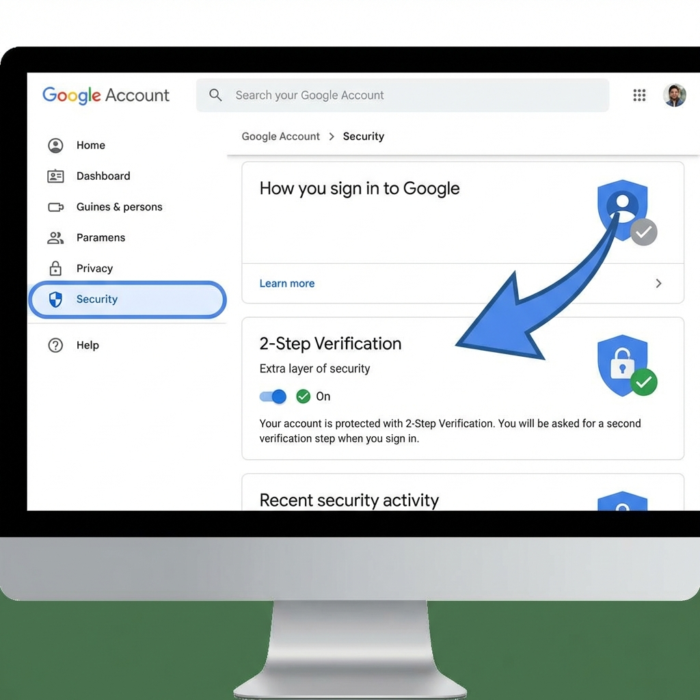
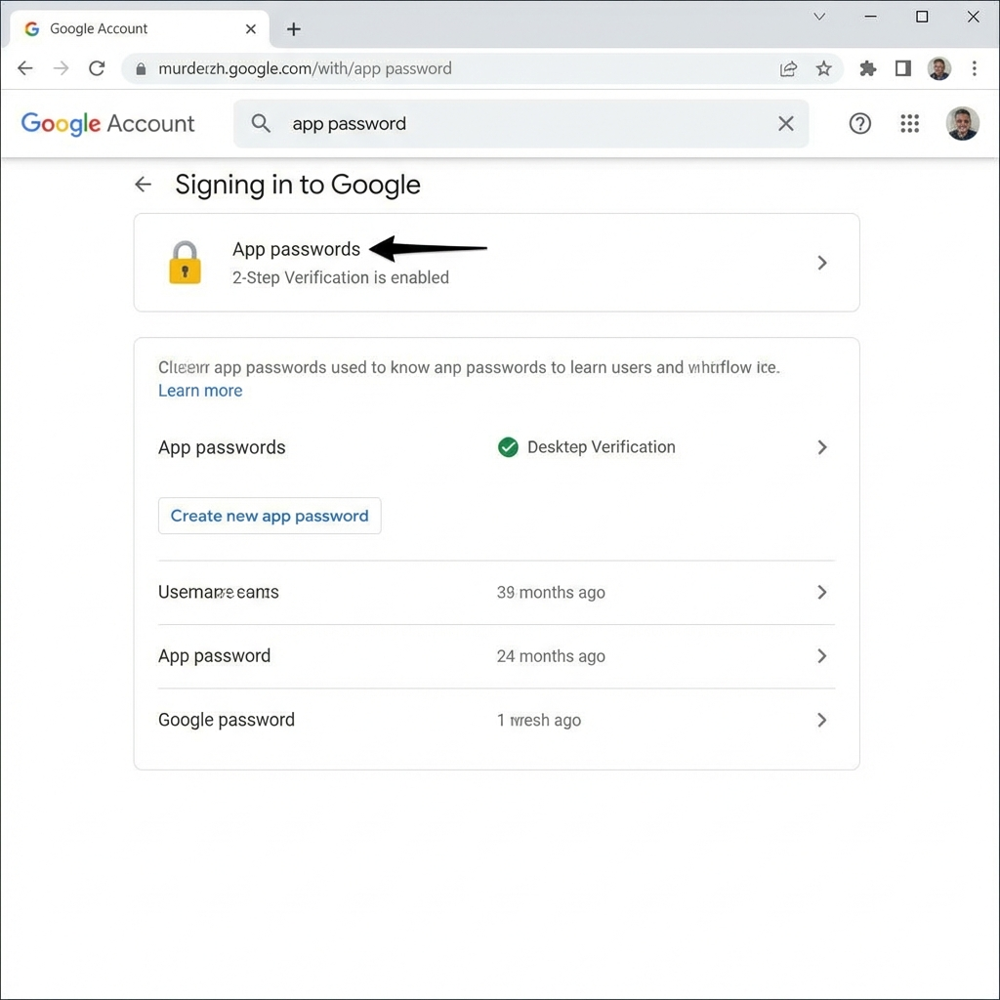
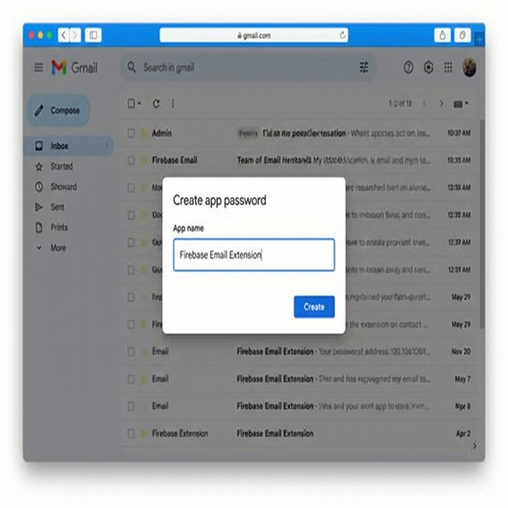
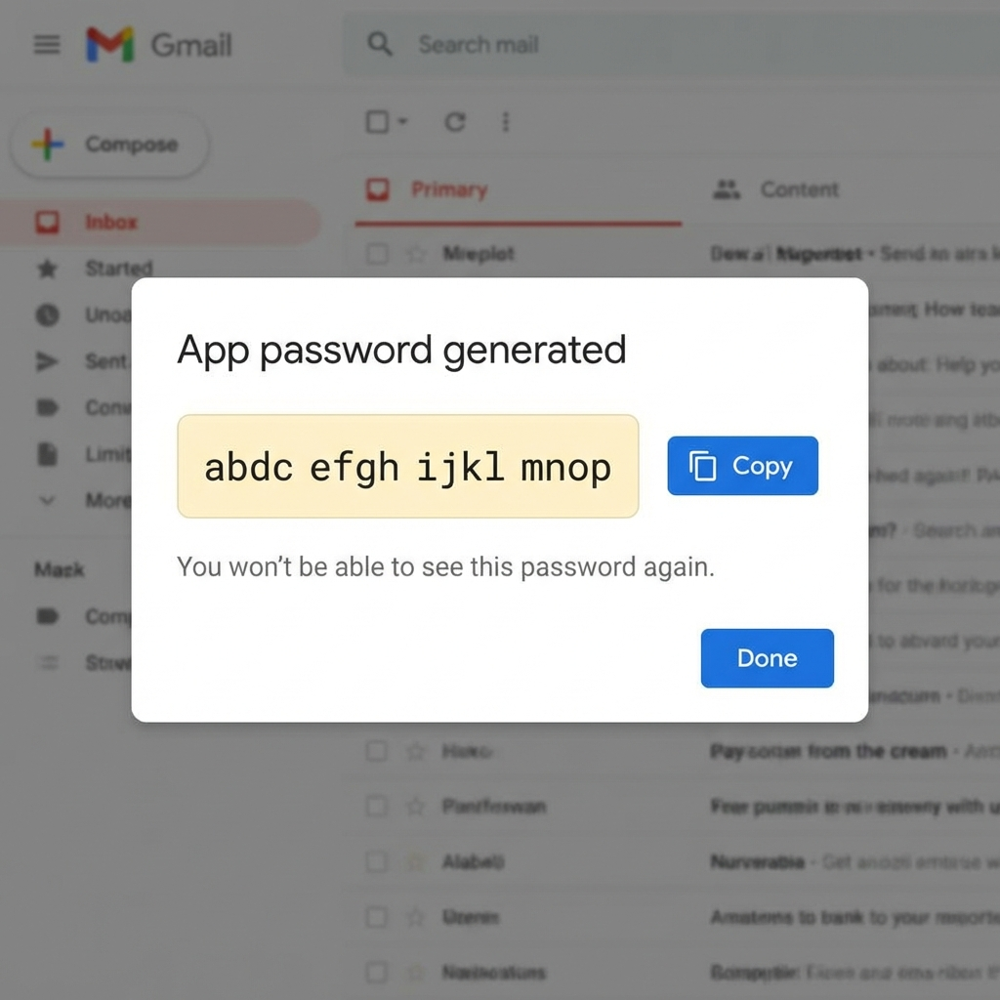

# Club Sponsorship Management System

A modern web application built with React and Firebase to help sports clubs manage their sponsorship packages, invite sponsors, and track engagements.

## Tech Stack

- **Frontend**: React 19 (TypeScript)
- **UI Framework**: [Mantine 8](https://mantine.dev/)
- **Query Management**: [TanStack Query (React Query)](https://tanstack.com/query/latest)
- **Bundler**: Webpack 5
- **Backend / Database**: Firebase (Authentication & Cloud Firestore)
- **Forms & Validation**: Mantine Form & Zod
---

## Project Structure

```text
src/
├── components/          # Reusable UI components
├── hooks/               # Custom React hooks (e.g., useAuth)
├── lib/                 # Core library initializations (Firebase)
├── pages/               # Individual page components (Login, Signup, etc.)
├── schemas/             # Zod schemas for validation
└── routes.tsx           # Centralized routing configuration
```

---

## Local Development Setup

### Prerequisites
- **Node.js**: v22 or higher (Check version: `node -v`)
- **Yarn**: v1.22.x (Check version: `yarn -v`)

### 1. Clone the repository
```bash
git clone https://github.com/manufac-analytics/club.git
cd <project-folder>
```

### 2. Install dependencies
```bash
yarn install
```

### 3. Start the development server
```bash
yarn start
```
The app will be available at `http://localhost:8080` (or the next available port).

### 4. Other useful commands
- `yarn build`: Create a production-ready bundle.
- `yarn lint`: Run ESLint to check for code quality issues.
- `yarn pretty`: Run Prettier to format the code.

---

## Firebase Configuration & Setup

If you need to switch to a new Firebase account or project, follow these steps:

### 1. Create a Firebase Project
1. Go to the [Firebase Console](https://console.firebase.google.com/).
2. Click **Add Project** and follow the setup wizard.
3. Once the project is created, click the add app button (You will see after your project name) and then click the **Web** icon (`</>`) to add a web app.
4. Register the app (e.g., "Club Management").
5. Copy the `firebaseConfig` object provided in the setup.

### 2. Enable Required Services

#### Authentication
1. Go to **Firebase Console → Build → Authentication → Get Started**.
2. Enable the **Email/Password** sign-in provider.

### 3. Update the Project Config (Web)
Locate the file `src/lib/firebase-config.ts` and replace the existing `FirebaseConfig` object with your new credentials.

---

## Firebase Authentication: Allowing email sign in and password reset
  
Understanding Email Enumeration Protection

  Firebase’s email enumeration protection hides whether an email is registered, preventing attackers from discovering valid user accounts.

Why Turn This Protection Off?

  - While it’s safer to hide if an email exists, it can mess with how users log in.
  - With this protection **on**, Firebase won't tell you if the email exists.
  - So when a user enters their email, FirebaseUI jumps right to "**Create Account**". [Reference 1](https://github.com/firebase/firebaseui-web/issues/1040) [Reference 2](https://stackoverflow.com/questions/77475409/firebase-authentication-email-provider-only-allows-new-account-creation)
  - If you **turn the protection off**, the app will redirect existing email users to login screen where they can either login or reset their password.

Steps

  - This needs to be turned off in the firebase console.
  - Go to **Authentication → Settings -> User actions** in the Firebase console.
  - Make sure **Email enumeration protection** is turned **OFF**.

---

## Firestore Database

  1. Go to **Firestore Database** > **Create Database**.
  2. Start in **Production Mode** or **Test Mode** (Note: Test mode expires in 30 days).
  3. Choose the desired region.

---

## Deployment

The project is configured to deploy to Firebase Hosting.

### 1. Install Firebase CLI
```bash
yarn global add firebase-tools
```

### 2. Login and Initialize
```bash
firebase login
firebase use --add  # Select your new firebase project
```

### 3. Build and Deploy
```bash
yarn build
firebase deploy
```
The project will be deployed from the `dist/bundle` directory as specified in `firebase.json`.

---

---

## Email Service (Firestore → Send Email)

The application uses the **Firebase "Trigger Email from Firestore" extension** to send sponsor invitation emails when a Firestore document is created.

**Extension Reference:** https://extensions.dev/extensions/firebase/firestore-send-email

---

## Setting Up Email Service

### Prerequisites

Before installing the extension, you need:

1. **Gmail account** with 2-Step Verification enabled
2. **Gmail App Password** (16-character password for SMTP access)

---

### Step 1: Generate Gmail App Password

#### 1.1 Enable 2-Step Verification
1. Go to [Google Account Security](https://myaccount.google.com/security)
2. Enable **2-Step Verification** if not already enabled



#### 1.2 Create App Password
1. Search for **"app password"** in Google Account settings
2. Click **"Create new app password"**
3. Enter name: `Firebase Email Extension`
4. Click **Create**





#### 1.3 Copy Password
1. Copy the 16-character password
2. **⚠️ CRITICAL:** Remove ALL spaces before using
   - Example: `abcd efgh ijkl mnop` → `abcdefghijklmnop`



---

### Step 2: Install Extension

#### Option A: Using Firebase CLI (Recommended for Local Development)

```bash
# Install Firebase CLI
yarn global add firebase-tools

# Login to Firebase
firebase login

# Install the extension
firebase ext:install firebase/firestore-send-email --project=projectId_or_alias

# Deploy
firebase deploy --only extensions --project=projectId_or_alias
```

#### Option B: Using Firebase Console (Manual Setup)

1. Go to [Firebase Console](https://console.firebase.google.com/) → **Extensions**
2. Click **Install Extension**
3. Search for **"Trigger Email from Firestore"**
4. Click **Install in console**

---

### Step 3: Configure Extension

During installation, configure with these **required** settings:

| Setting | Value | Notes |
|---------|-------|-------|
| **Firestore Instance Location** | `asia-south2` (or your region) | Choose closest region |
| **Authentication Type** | `Username & Password` | For Gmail SMTP |
| **SMTP connection URI** | `smtps://your-email@gmail.com:YOUR_APP_PASSWORD@smtp.gmail.com:465` | **Remove spaces from password!** |
| **OAuth2 SMTP Port** | `465` | Gmail SMTP port |
| **Use secure OAuth2 connection?** | `Yes` | Must be enabled |
| **Email documents collection** | `mail` | Firestore collection name |
| **Default FROM address** | `your-email@gmail.com` | Your Gmail address |
| **Firestore TTL type** | `Week` | Auto-delete emails after |
| **Firestore TTL value** | `1` | 1 week |

#### SMTP Connection URI Format

```text
smtps://test@manufacanalytics.com:abcdefghijklmnop@smtp.gmail.com:465
```

**Breakdown:**
- `smtps://` = Secure SMTP protocol
- `test@manufacanalytics.com` = Your Gmail
- `abcdefghijklmnop` = App password (**NO SPACES!**)
- `smtp.gmail.com:465` = Gmail SMTP server and port

---

### Step 4: Test Email Sending

Add a document to the `mail` collection in Firestore:

```javascript
const emailDoc = {
  to: ["recipient@example.com"],
  message: {
    subject: "Test Email",
    html: "<h1>Hello!</h1><p>This is a test.</p>"
  }
};

await db.collection('mail').add(emailDoc);
```

Check status in Firestore:
- `delivery.state: "SUCCESS"` = Email sent ✅
- `delivery.state: "ERROR"` = Check `delivery.error` for details ❌

---

### Sending Emails in Your App

```typescript
// Sponsor invitation example
const sponsorEmail = {
  to: ["sponsor@company.com"],
  message: {
    subject: "You're Invited to Sponsor Our Club!",
    html: `
      <div style="font-family: Arial, sans-serif;">
        <h1>Sponsorship Invitation</h1>
        <p>Dear Sponsor,</p>
        <p>We would like to invite you to become a sponsor.</p>
        <a href="https://yourclub.com/packages/123" 
           style="background: #007bff; color: white; padding: 10px 20px; 
                  text-decoration: none; border-radius: 5px;">
          View Package
        </a>
      </div>
    `
  }
};

await db.collection('mail').add(sponsorEmail);
```

---

### Troubleshooting

| Error | Solution |
|-------|----------|
| **"Invalid login: 535-5.7.8"** | App password has spaces or is incorrect. Regenerate and remove ALL spaces. |
| **"SMTP connection failed"** | Check URI format and ensure port is `465` and secure connection is `Yes`. |
| **Emails not sending** | Verify `mail` collection name, check Firebase Extensions logs, ensure sender email matches Gmail. |
| **"Parameter not set" for SMTP password** | This is normal - password is in the URI. Leave SMTP password field empty. |

---

### Security Best Practices

```text
// Firestore Security Rules
rules_version = '2';
service cloud.firestore {
  match /databases/{database}/documents {
    match /mail/{emailId} {
      allow create: if request.auth != null;  // Only authenticated users
      allow read, update, delete: if false;    // Only extension can access
    }
  }
}
```

**Important:**
- Never commit app passwords to version control
- Rotate app passwords periodically
- Monitor email logs in Firebase Console


